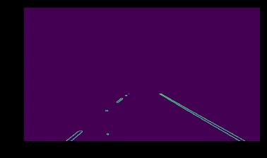

## Project: Search and Sample Return
Target of this project is to identify lane lines. The identified lane lines are mapped on a vide which is stored. Open CV is used for the computer vision algorithms. 

## Dependencies
You'll need Python 3 and Jupyter Notebooks installed to do this project.  The best way to get setup with these if you are not already is to use Anaconda following along with the [CarND-Term1-Starter-Kit](https://github.com/udacity/CarND-Term1-Starter-Kit/blob/master/README.md). 

>1. Notebook File: P1.ipynb
>2. Output Videos: output/solidWhiteRight.mp4
>output/solidYellowLeft.mp4

### Reflection

### 1. Describe your pipeline. As part of the description, explain how you modified the draw_lines() function.

My pipeline consisted of 7 steps after the loading. 

1.  Converted the images to grayscale

```
def grayscale(img):

    """Applies the Grayscale transform
    This will return an image with only one color channel
    but NOTE: to see the returned image as grayscale
    (assuming your grayscaled image is called 'gray')
    you should call plt.imshow(gray, cmap='gray')"""

    return cv2.cvtColor(img, cv2.COLOR_RGB2GRAY)
    # Or use BGR2GRAY if you read an image with cv2.imread()
    # return cv2.cvtColor(img, cv2.COLOR_BGR2GRAY)

```

2. Apply Canny Edges detection to the grayscale image


`def canny(img, low_threshold, high_threshold):`

```
    """Applies the Canny transform"""
    return cv2.Canny(img, low_threshold, high_threshold)
```

3. Apply the gausian blur to reduce the noise

```def gaussian_blur(img, kernel_size):

    """Applies a Gaussian Noise kernel"""
    return cv2.GaussianBlur(img, (kernel_size, kernel_size), 0)

```

4.  Selected the region of interest selected by relative coordinates not the absolute coordinates

```
def region_of_interest(img, vertices):

    """
    Applies an image mask.
    
    Only keeps the region of the image defined by the polygon
    formed from `vertices`. The rest of the image is set to black.
    """
    #defining a blank mask to start with
    mask = np.zeros_like(img)   
    
    #defining a 3 channel or 1 channel color to fill the mask with depending on the input image
    if len(img.shape) > 2:
        channel_count = img.shape[2]  # i.e. 3 or 4 depending on your image
        ignore_mask_color = (255,) * channel_count
    else:
        ignore_mask_color = 255
        
    #filling pixels inside the polygon defined by "vertices" with the fill color    
    cv2.fillPoly(mask, vertices, ignore_mask_color)
    
    #returning the image only where mask pixels are nonzero
    masked_image = cv2.bitwise_and(img, mask)
    return masked_image
```

5. Draw lines

To avoid division to zero errors when no line was detected the linear regression was used to extrapolate lines

```def draw_lines(img, lines, color=[255, 0, 0], thickness=2):

       # create list to store x, y values as vector X, Y for each line
    left_line_x = []
    left_line_y = []
    right_line_x = []
    right_line_y = []
    # get image shape to accomodate different resolution
    imshape = img.shape
    y_top = int(0.63*imshape[0])
    y_bottom = imshape[0]
    # groupe the coordinates for two lines
    for line in lines:
        for x1,y1,x2,y2 in line:
            slope = ((y2-y1)/(x2-x1))
            if slope <= 0:
                left_line_x += [x1, x2]
                left_line_y += [y1, y2]
            else:
                right_line_x += [x1, x2]
                right_line_y += [y1, y2] 
   
    # use linear regression to extrapolate lines to avoid division to zero errors when no line could be detected
    if len(left_line_x) and len(left_line_y):
        k_left, b_left, r_value, p_value, std_err = stats.linregress(left_line_x,left_line_y)
        x_top_left = int((y_top-b_left)/(k_left))
        x_bottom_left = int((y_bottom-b_left)/(k_left))
        cv2.line(img, (x_top_left, y_top), (x_bottom_left, y_bottom), color, thickness)
    if len(right_line_x) and len(right_line_y):
        k_right, b_right, r_value, p_value, std_err = stats.linregress(right_line_x,right_line_y)
        x_top_right = int((y_top-b_right)/(k_right))
        x_bottom_right = int((y_bottom-b_right)/(k_right))
        cv2.line(img, (x_top_right, y_top), (x_bottom_right, y_bottom), color, thickness)
```
6. Hugh Transform
```
def hough_lines(img, rho, theta, threshold, min_line_len, max_line_gap):
    """
    `img` should be the output of a Canny transform.
        
    Returns an image with hough lines drawn.
    """
    lines = cv2.HoughLinesP(img, rho, theta, threshold, np.array([]), minLineLength=min_line_len, maxLineGap=max_line_gap)
    line_img = np.zeros((img.shape[0], img.shape[1], 3), dtype=np.uint8)
    draw_lines(line_img, lines)
    return line_img
```
the result looked then like this:



7. Combining origin and mask

### 2. Identify potential shortcomings with your current pipeline


The quality of the identification is dependent on the light situation. Dynamic threshold adjustments might be working. The area of interest selection does not work well on driving curves. This area needs to be revisited.


